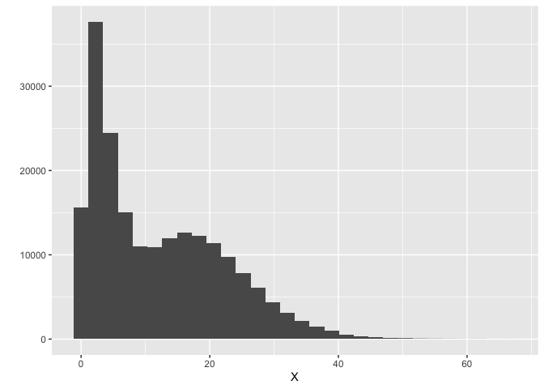
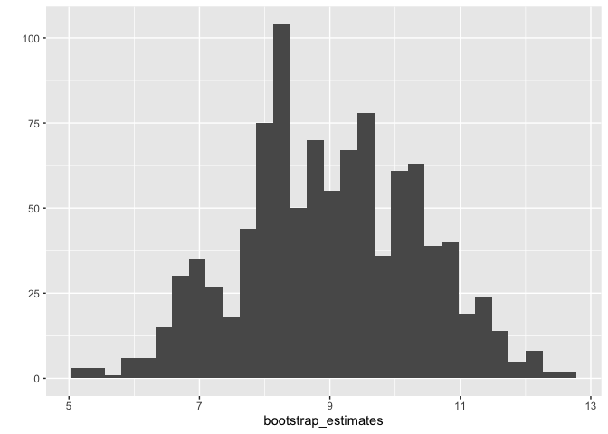

Bootstrap
================
Joshua Loftus
4/16/2020

Bootstrap intervals
-------------------

``` r
n <- 200000
mix <- rbinom(n, 1, .5)
X <- mix * rchisq(n, 3, 1) + (1-mix) * rchisq(n, 10, 10)
qplot(X)
```

    ## `stat_bin()` using `bins = 30`. Pick better value with `binwidth`.



``` r
sqrt(prod(quantile(X, probs = c(.4, .6))))
```

    ## [1] 9.056357

The above is a population, this collects a sample -- which may be costly

``` r
Xs <- sample(X, 100, replace = FALSE)
sqrt(prod(quantile(Xs, probs = c(.4, .6))))
```

    ## [1] 8.895783

Now we have the sample, so re-sampling from it on the computer is cheap

``` r
Xsb <- sample(Xs, 100, replace = TRUE)
sqrt(prod(quantile(Xsb, probs = c(.4, .6))))
```

    ## [1] 10.61089

Confidence intervals
--------------------

``` r
B <- 1000
estimator <- function(subsample) {
  sqrt(prod(quantile(subsample, probs = c(.4, .6))))  
}
bootstrap_iteration <- function(Xsample) {
  subsample <- sample(Xsample, length(Xsample), replace = TRUE)  
  estimator(subsample)
}
bootstrap_estimates <- replicate(B, bootstrap_iteration(Xs))
```

Bootstrap estimate of the sampling distribution of our estimator

``` r
qplot(bootstrap_estimates)
```

    ## `stat_bin()` using `bins = 30`. Pick better value with `binwidth`.



Quantiles of the boostrap replications can be used to get confidence intervals

``` r
quantile(bootstrap_estimates, probs = c(0.025, 0.972))
```

    ##      2.5%     97.2% 
    ##  6.462483 11.507391
