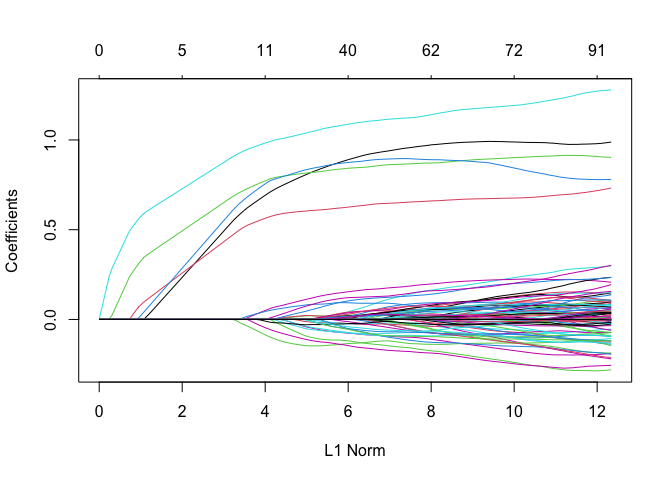
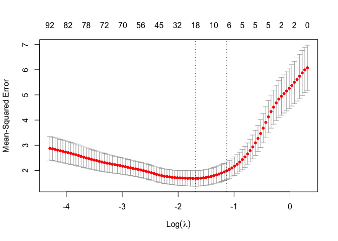
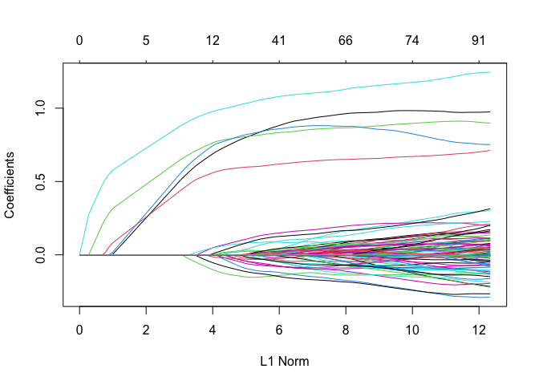
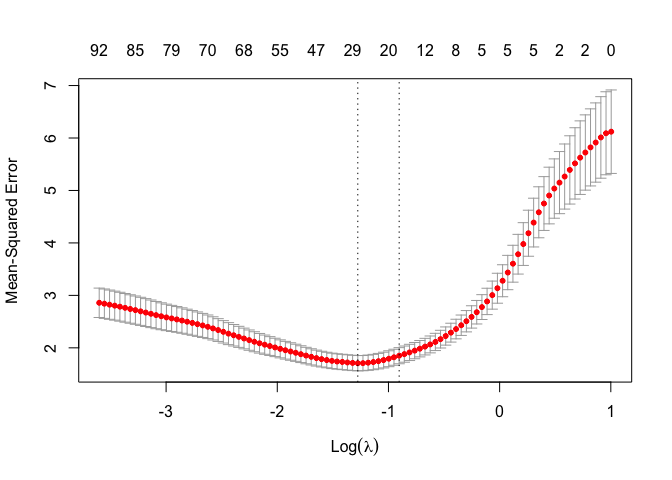

Lasso
================
Joshua Loftus
3/27/2020

``` r
library(glmnet)
```

    ## Loading required package: Matrix

    ## Loaded glmnet 4.0

``` r
library(hdi)
```

    ## Loading required package: scalreg

    ## Loading required package: lars

    ## Loaded lars 1.2

``` r
library(RPtests)
library(SLOPE)
library(knockoff)
library(stabs)
```

    ## Loading required package: parallel

``` r
library(selectiveInference)
```

    ## Loading required package: intervals

    ## 
    ## Attaching package: 'intervals'

    ## The following object is masked from 'package:Matrix':
    ## 
    ##     expand

    ## Loading required package: survival

    ## 
    ## Attaching package: 'survival'

    ## The following object is masked from 'package:SLOPE':
    ## 
    ##     heart

    ## Loading required package: adaptMCMC

    ## Loading required package: coda

    ## Loading required package: MASS

High dimensional regression
---------------------------

``` r
n <- 100
p <- 200
rho <- 0.000001
sparsity <- 5

pairwise_incoherence <- function(x) {
  X <- scale(x) / sqrt(n-1)
  pi_x <- max(abs(t(X) %*% X - diag(rep(1, p))))
  pi_x
}

oracle_irrepresentability_constant <- function(x, sparsity) {
  p <- ncol(x)
  Xs <- x[,1:sparsity]
  PXs <- MASS::ginv(t(Xs) %*% Xs) %*% t(Xs)
  PXsXj <- PXs %*% x[,(sparsity+1):p]
  L1norms <- apply(PXsXj, 2, function(xj) sum(abs(xj)))
  gamma <- 1 - max(L1norms)
  gamma
}

oracle_lambda <- function(x, sparsity, sigma = 1) {
  # 8*K*sigma/gamma * sqrt(log(p)/n)
  n <- nrow(x)
  p <- ncol(x)
  K <- max(sqrt(colSums(x^2))/sqrt(n))
  gamma <- oracle_irrepresentability_constant(x, sparsity)
  lambda <- 8 * K * sigma * sqrt(log(p)/n) / gamma
  lambda
}

oracle_beta_min <- function(x, sparsity) {
  # minimum beta condition
  n <- nrow(x)
  Xs <- x[,1:sparsity]
  C <- min(eigen(t(Xs) %*% Xs / n)$values)
  Xinfty <- max(apply(MASS::ginv(t(Xs) %*% Xs / n), 2, function(row) sum(abs(row))))
  lambda <- oracle_lambda(x, sparsity)
  beta_min <- lambda * (4*1/sqrt(C) + Xinfty)
  beta_min
}

correlated_gaussian_design <- function(n, p, rho) {
  x <- matrix(rnorm(n*p), nrow = n)
  z <- matrix(rep(t(rnorm(n)), p), nrow = n)
  sqrt(1-rho)*x + sqrt(rho)*z
}
```

Assumptions of support recovery theory
--------------------------------------

### Linear model?

Difficult to check, limited theory for regression diagnostics in high-dimensional models

### Irrepresentability condition?

Requires knowing support, or bounding by checking on all subsets

``` r
choose(50, 5)
```

    ## [1] 2118760

-   Computationally infeasible
-   Might give a poor bound

### Bound on columns of X

Easy

### Minimum eigenvalue

Similar story to the irrepresentability condition

### Lower bound on lambda

Need gamma (hard) and sigma (variance of the noise)

Sigma may reasonably estimated

### Minimum beta bound

Requires the minimum eigenvalue, sigma, knowing the support:

∥(*X*<sub>*S*</sub><sup>*T*</sup>*X*<sub>*S*</sub>/*n*)<sup>−1</sup>∥<sub>∞</sub>

### Idea:

Use cross-validation to pick lambda, therefore $\\hat S$ and $\\hat \\sigma^2$, and then check all these constants using $\\hat S$.

``` r
x <- correlated_gaussian_design(n, p, rho)

pairwise_incoherence(x)
```

    ## [1] 0.4014258

``` r
oracle_irrepresentability_constant(x, sparsity)
```

    ## [1] 0.1775206

``` r
B <- oracle_beta_min(x, sparsity)
B <- 1

beta <- c(rep(B, sparsity), rep(0, p - sparsity))
y <- x %*% beta + rnorm(n)
```

Lasso
-----

``` r
fit <- glmnet(x, y, intercept = FALSE)
plot(fit)
```



Cross-validation
----------------

``` r
cv_fit <- cv.glmnet(x, y, intercept = FALSE)
plot(cv_fit)
```



``` r
coef(fit, s = cv_fit$lambda.min, intercept = FALSE)
```

    ## 201 x 1 sparse Matrix of class "dgCMatrix"
    ##                       1
    ## (Intercept)  .         
    ## V1           0.76327674
    ## V2           0.59464296
    ## V3           0.80310250
    ## V4           0.80561846
    ## V5           1.01582328
    ## V6           .         
    ## V7          -0.01163387
    ## V8           .         
    ## V9           .         
    ## V10          .         
    ## V11          .         
    ## V12          .         
    ## V13          .         
    ## V14          .         
    ## V15          .         
    ## V16          .         
    ## V17          .         
    ## V18          .         
    ## V19          .         
    ## V20          .         
    ## V21          .         
    ## V22          .         
    ## V23          .         
    ## V24         -0.13064414
    ## V25          .         
    ## V26          .         
    ## V27          .         
    ## V28          .         
    ## V29          0.08766166
    ## V30          .         
    ## V31          .         
    ## V32          .         
    ## V33          .         
    ## V34          .         
    ## V35          .         
    ## V36          0.01050104
    ## V37          .         
    ## V38          .         
    ## V39          .         
    ## V40          .         
    ## V41          .         
    ## V42          .         
    ## V43          .         
    ## V44          .         
    ## V45          .         
    ## V46         -0.05091467
    ## V47          .         
    ## V48          .         
    ## V49          .         
    ## V50          .         
    ## V51          .         
    ## V52          .         
    ## V53          .         
    ## V54          .         
    ## V55          .         
    ## V56          0.01377979
    ## V57          .         
    ## V58          .         
    ## V59          .         
    ## V60          .         
    ## V61          .         
    ## V62          .         
    ## V63          .         
    ## V64          .         
    ## V65          .         
    ## V66          .         
    ## V67          .         
    ## V68          .         
    ## V69          .         
    ## V70          .         
    ## V71          .         
    ## V72         -0.01099123
    ## V73          .         
    ## V74          .         
    ## V75          .         
    ## V76          .         
    ## V77          .         
    ## V78          .         
    ## V79          .         
    ## V80          .         
    ## V81          .         
    ## V82          .         
    ## V83          .         
    ## V84          .         
    ## V85          .         
    ## V86          .         
    ## V87          .         
    ## V88          .         
    ## V89          .         
    ## V90          .         
    ## V91          .         
    ## V92          .         
    ## V93          0.02322112
    ## V94          .         
    ## V95          .         
    ## V96          .         
    ## V97          .         
    ## V98          .         
    ## V99          .         
    ## V100         .         
    ## V101         .         
    ## V102         .         
    ## V103         .         
    ## V104         .         
    ## V105         .         
    ## V106         .         
    ## V107        -0.08727834
    ## V108         .         
    ## V109         .         
    ## V110         .         
    ## V111         .         
    ## V112         .         
    ## V113         .         
    ## V114         .         
    ## V115         .         
    ## V116         .         
    ## V117         0.06818212
    ## V118         .         
    ## V119        -0.02624784
    ## V120         .         
    ## V121         .         
    ## V122         .         
    ## V123         .         
    ## V124         .         
    ## V125         .         
    ## V126         .         
    ## V127         .         
    ## V128         .         
    ## V129         .         
    ## V130         .         
    ## V131         .         
    ## V132         .         
    ## V133         .         
    ## V134         0.04279436
    ## V135         .         
    ## V136         .         
    ## V137         .         
    ## V138         .         
    ## V139         .         
    ## V140         .         
    ## V141         .         
    ## V142         .         
    ## V143         .         
    ## V144         .         
    ## V145         .         
    ## V146         .         
    ## V147         .         
    ## V148         .         
    ## V149         .         
    ## V150         .         
    ## V151         .         
    ## V152         .         
    ## V153         .         
    ## V154         .         
    ## V155         .         
    ## V156         .         
    ## V157         .         
    ## V158         .         
    ## V159         .         
    ## V160         .         
    ## V161         .         
    ## V162         .         
    ## V163         .         
    ## V164         .         
    ## V165         .         
    ## V166         .         
    ## V167         .         
    ## V168         .         
    ## V169         .         
    ## V170         .         
    ## V171         .         
    ## V172         .         
    ## V173         .         
    ## V174         .         
    ## V175         .         
    ## V176         .         
    ## V177         .         
    ## V178        -0.02259905
    ## V179         .         
    ## V180         .         
    ## V181         .         
    ## V182         .         
    ## V183         .         
    ## V184         .         
    ## V185         .         
    ## V186         .         
    ## V187         .         
    ## V188         .         
    ## V189         .         
    ## V190         .         
    ## V191         .         
    ## V192         .         
    ## V193         .         
    ## V194         .         
    ## V195         .         
    ## V196         .         
    ## V197         .         
    ## V198         .         
    ## V199         .         
    ## V200         .

``` r
coef(fit, s = oracle_lambda(x, sparsity), intercept = FALSE)
```

    ## 201 x 1 sparse Matrix of class "dgCMatrix"
    ##             1
    ## (Intercept) .
    ## V1          .
    ## V2          .
    ## V3          .
    ## V4          .
    ## V5          .
    ## V6          .
    ## V7          .
    ## V8          .
    ## V9          .
    ## V10         .
    ## V11         .
    ## V12         .
    ## V13         .
    ## V14         .
    ## V15         .
    ## V16         .
    ## V17         .
    ## V18         .
    ## V19         .
    ## V20         .
    ## V21         .
    ## V22         .
    ## V23         .
    ## V24         .
    ## V25         .
    ## V26         .
    ## V27         .
    ## V28         .
    ## V29         .
    ## V30         .
    ## V31         .
    ## V32         .
    ## V33         .
    ## V34         .
    ## V35         .
    ## V36         .
    ## V37         .
    ## V38         .
    ## V39         .
    ## V40         .
    ## V41         .
    ## V42         .
    ## V43         .
    ## V44         .
    ## V45         .
    ## V46         .
    ## V47         .
    ## V48         .
    ## V49         .
    ## V50         .
    ## V51         .
    ## V52         .
    ## V53         .
    ## V54         .
    ## V55         .
    ## V56         .
    ## V57         .
    ## V58         .
    ## V59         .
    ## V60         .
    ## V61         .
    ## V62         .
    ## V63         .
    ## V64         .
    ## V65         .
    ## V66         .
    ## V67         .
    ## V68         .
    ## V69         .
    ## V70         .
    ## V71         .
    ## V72         .
    ## V73         .
    ## V74         .
    ## V75         .
    ## V76         .
    ## V77         .
    ## V78         .
    ## V79         .
    ## V80         .
    ## V81         .
    ## V82         .
    ## V83         .
    ## V84         .
    ## V85         .
    ## V86         .
    ## V87         .
    ## V88         .
    ## V89         .
    ## V90         .
    ## V91         .
    ## V92         .
    ## V93         .
    ## V94         .
    ## V95         .
    ## V96         .
    ## V97         .
    ## V98         .
    ## V99         .
    ## V100        .
    ## V101        .
    ## V102        .
    ## V103        .
    ## V104        .
    ## V105        .
    ## V106        .
    ## V107        .
    ## V108        .
    ## V109        .
    ## V110        .
    ## V111        .
    ## V112        .
    ## V113        .
    ## V114        .
    ## V115        .
    ## V116        .
    ## V117        .
    ## V118        .
    ## V119        .
    ## V120        .
    ## V121        .
    ## V122        .
    ## V123        .
    ## V124        .
    ## V125        .
    ## V126        .
    ## V127        .
    ## V128        .
    ## V129        .
    ## V130        .
    ## V131        .
    ## V132        .
    ## V133        .
    ## V134        .
    ## V135        .
    ## V136        .
    ## V137        .
    ## V138        .
    ## V139        .
    ## V140        .
    ## V141        .
    ## V142        .
    ## V143        .
    ## V144        .
    ## V145        .
    ## V146        .
    ## V147        .
    ## V148        .
    ## V149        .
    ## V150        .
    ## V151        .
    ## V152        .
    ## V153        .
    ## V154        .
    ## V155        .
    ## V156        .
    ## V157        .
    ## V158        .
    ## V159        .
    ## V160        .
    ## V161        .
    ## V162        .
    ## V163        .
    ## V164        .
    ## V165        .
    ## V166        .
    ## V167        .
    ## V168        .
    ## V169        .
    ## V170        .
    ## V171        .
    ## V172        .
    ## V173        .
    ## V174        .
    ## V175        .
    ## V176        .
    ## V177        .
    ## V178        .
    ## V179        .
    ## V180        .
    ## V181        .
    ## V182        .
    ## V183        .
    ## V184        .
    ## V185        .
    ## V186        .
    ## V187        .
    ## V188        .
    ## V189        .
    ## V190        .
    ## V191        .
    ## V192        .
    ## V193        .
    ## V194        .
    ## V195        .
    ## V196        .
    ## V197        .
    ## V198        .
    ## V199        .
    ## V200        .

Elastic net
-----------

"Within group" correlation specifically

``` r
correlated_gaussian_design <- function(n, p, rho) {
  x <- matrix(rnorm(n*p), nrow = n)
  z <- matrix(rep(t(rnorm(n)), p), nrow = n)
  sqrt(1-rho)*x + sqrt(rho)*z
}

fit <- glmnet(x, y, alpha = .9)
plot(fit)
```



Cross-validation
----------------

``` r
cv_fit <- cv.glmnet(x, y, alpha = .5)
plot(cv_fit)
```



``` r
coef(fit, s = cv_fit$lambda.min)
```

    ## 201 x 1 sparse Matrix of class "dgCMatrix"
    ##                        1
    ## (Intercept)  0.057823329
    ## V1           0.665382928
    ## V2           0.546452221
    ## V3           0.748070352
    ## V4           0.719742445
    ## V5           0.965857780
    ## V6           .          
    ## V7           .          
    ## V8           .          
    ## V9           .          
    ## V10          .          
    ## V11          .          
    ## V12          .          
    ## V13          .          
    ## V14          .          
    ## V15          .          
    ## V16          .          
    ## V17          .          
    ## V18          .          
    ## V19          .          
    ## V20          .          
    ## V21          .          
    ## V22          .          
    ## V23          .          
    ## V24         -0.086370090
    ## V25          .          
    ## V26          .          
    ## V27          .          
    ## V28          .          
    ## V29          0.033218612
    ## V30          .          
    ## V31          .          
    ## V32          .          
    ## V33          .          
    ## V34          .          
    ## V35          .          
    ## V36          .          
    ## V37          .          
    ## V38          .          
    ## V39          .          
    ## V40          .          
    ## V41          .          
    ## V42          .          
    ## V43          .          
    ## V44          .          
    ## V45          .          
    ## V46          .          
    ## V47          .          
    ## V48          .          
    ## V49          .          
    ## V50          .          
    ## V51          .          
    ## V52          .          
    ## V53          .          
    ## V54          .          
    ## V55          .          
    ## V56          .          
    ## V57          .          
    ## V58          .          
    ## V59          .          
    ## V60          .          
    ## V61          .          
    ## V62          .          
    ## V63          .          
    ## V64          .          
    ## V65          .          
    ## V66          .          
    ## V67          .          
    ## V68          .          
    ## V69          .          
    ## V70          .          
    ## V71          .          
    ## V72          .          
    ## V73          .          
    ## V74          .          
    ## V75          .          
    ## V76          .          
    ## V77          .          
    ## V78          .          
    ## V79          .          
    ## V80          .          
    ## V81          .          
    ## V82          .          
    ## V83          .          
    ## V84          .          
    ## V85          .          
    ## V86          .          
    ## V87          .          
    ## V88          .          
    ## V89          .          
    ## V90          .          
    ## V91          .          
    ## V92          .          
    ## V93          .          
    ## V94          .          
    ## V95          .          
    ## V96          .          
    ## V97          .          
    ## V98          .          
    ## V99          .          
    ## V100         .          
    ## V101         .          
    ## V102         .          
    ## V103         .          
    ## V104         .          
    ## V105         .          
    ## V106         .          
    ## V107        -0.040583485
    ## V108         .          
    ## V109         .          
    ## V110         .          
    ## V111         .          
    ## V112         .          
    ## V113         .          
    ## V114         .          
    ## V115         .          
    ## V116         .          
    ## V117         0.038434837
    ## V118         .          
    ## V119         .          
    ## V120         .          
    ## V121         .          
    ## V122         .          
    ## V123         .          
    ## V124         .          
    ## V125         .          
    ## V126         .          
    ## V127         .          
    ## V128         .          
    ## V129         .          
    ## V130         .          
    ## V131         .          
    ## V132         .          
    ## V133         .          
    ## V134         .          
    ## V135         .          
    ## V136         .          
    ## V137         .          
    ## V138         .          
    ## V139         .          
    ## V140         .          
    ## V141         .          
    ## V142         .          
    ## V143         .          
    ## V144         .          
    ## V145         .          
    ## V146         .          
    ## V147         .          
    ## V148         .          
    ## V149         .          
    ## V150         .          
    ## V151         .          
    ## V152         .          
    ## V153         .          
    ## V154         .          
    ## V155         .          
    ## V156         .          
    ## V157         .          
    ## V158         .          
    ## V159         .          
    ## V160         .          
    ## V161         .          
    ## V162         .          
    ## V163         .          
    ## V164         .          
    ## V165         .          
    ## V166         .          
    ## V167         .          
    ## V168         .          
    ## V169         .          
    ## V170         .          
    ## V171         .          
    ## V172         .          
    ## V173         .          
    ## V174         .          
    ## V175         .          
    ## V176         .          
    ## V177         .          
    ## V178        -0.005766467
    ## V179         .          
    ## V180         .          
    ## V181         .          
    ## V182         .          
    ## V183         .          
    ## V184         .          
    ## V185         .          
    ## V186         .          
    ## V187         .          
    ## V188         .          
    ## V189         .          
    ## V190         .          
    ## V191         .          
    ## V192         .          
    ## V193         .          
    ## V194         .          
    ## V195         .          
    ## V196         .          
    ## V197         .          
    ## V198         .          
    ## V199         .          
    ## V200         .

Without an oracle...
--------------------

``` r
B <- oracle_beta_min(x, sparsity)
B <- 1

beta <- c(rep(B, sparsity), rep(0, p - sparsity))
y <- x %*% beta + rnorm(n)
```

Cross-validation to estimate sigma

``` r
# library(selectiveInference)
estimateSigma(x, y)
```

    ## $sigmahat
    ## [1] 0.8411692
    ## 
    ## $df
    ## [1] 46

Inference for lasso / high-dimensional regression
-------------------------------------------------

What's different compared to the low-dimensional case and the usual MLE theory?

Estimation -&gt; shrinkage -&gt; centers of intervals biased (toward zero)

True for James-Stein estimator of normal mean, penalized regression estimators, etc

### Idea: debiased lasso

Take support from lasso and then fit OLS on that support

``` r
fit <- glmnet(x, y, intercept = FALSE)

cv_fit <- cv.glmnet(x, y, intercept = FALSE)
cv_lambda <- cv_fit$lambda.min

support <- which(coef(fit, s = cv_lambda, intercept = FALSE) != 0) - 1
support
```

    ##  [1]   1   2   3   4   5  18  22  23  24  30  36  39  56  58  60  65  66  67  70
    ## [20]  83  88  95 110 117 123 125 128 133 138 150 155 158 159 164 171 173 175 185
    ## [39] 186 191 192 194 197

``` r
debiased_fit <- lm(y ~ x[,support])
summary(debiased_fit)
```

    ## 
    ## Call:
    ## lm(formula = y ~ x[, support])
    ## 
    ## Residuals:
    ##      Min       1Q   Median       3Q      Max 
    ## -1.13804 -0.30648 -0.04785  0.27033  1.05143 
    ## 
    ## Coefficients:
    ##                  Estimate Std. Error t value Pr(>|t|)    
    ## (Intercept)    -0.0952943  0.0805307  -1.183 0.241678    
    ## x[, support]1   0.9183442  0.0674421  13.617  < 2e-16 ***
    ## x[, support]2   1.0461535  0.0665446  15.721  < 2e-16 ***
    ## x[, support]3   1.2748762  0.0733536  17.380  < 2e-16 ***
    ## x[, support]4   0.7826614  0.0900412   8.692 5.69e-12 ***
    ## x[, support]5   0.7373464  0.0732897  10.061 3.67e-14 ***
    ## x[, support]6   0.1807415  0.0915926   1.973 0.053402 .  
    ## x[, support]7   0.1658158  0.0743241   2.231 0.029705 *  
    ## x[, support]8   0.0639492  0.0723261   0.884 0.380380    
    ## x[, support]9  -0.0195840  0.0895407  -0.219 0.827666    
    ## x[, support]10 -0.1021936  0.0779401  -1.311 0.195147    
    ## x[, support]11 -0.2016451  0.0753629  -2.676 0.009762 ** 
    ## x[, support]12 -0.1202340  0.0741904  -1.621 0.110718    
    ## x[, support]13  0.1364861  0.0712343   1.916 0.060473 .  
    ## x[, support]14 -0.0595594  0.0888820  -0.670 0.505551    
    ## x[, support]15 -0.1190142  0.0677118  -1.758 0.084271 .  
    ## x[, support]16  0.2237863  0.0726574   3.080 0.003205 ** 
    ## x[, support]17  0.2138859  0.0739555   2.892 0.005440 ** 
    ## x[, support]18  0.0653961  0.0752024   0.870 0.388230    
    ## x[, support]19 -0.0605867  0.0746623  -0.811 0.420528    
    ## x[, support]20  0.1068969  0.0695046   1.538 0.129684    
    ## x[, support]21 -0.2461992  0.0816066  -3.017 0.003837 ** 
    ## x[, support]22 -0.0878707  0.0847324  -1.037 0.304176    
    ## x[, support]23  0.0176384  0.0831736   0.212 0.832825    
    ## x[, support]24  0.1390916  0.0745040   1.867 0.067154 .  
    ## x[, support]25  0.1226255  0.0737505   1.663 0.101959    
    ## x[, support]26 -0.0437245  0.0765044  -0.572 0.569928    
    ## x[, support]27  0.1770115  0.0666412   2.656 0.010275 *  
    ## x[, support]28 -0.0627575  0.0890376  -0.705 0.483829    
    ## x[, support]29  0.1248260  0.0834640   1.496 0.140381    
    ## x[, support]30  0.0438275  0.0749349   0.585 0.560982    
    ## x[, support]31 -0.1015325  0.0741542  -1.369 0.176401    
    ## x[, support]32 -0.0001066  0.0948366  -0.001 0.999108    
    ## x[, support]33  0.0106892  0.0787580   0.136 0.892528    
    ## x[, support]34 -0.2497791  0.0666933  -3.745 0.000427 ***
    ## x[, support]35  0.1700795  0.0942064   1.805 0.076390 .  
    ## x[, support]36 -0.1578133  0.0759272  -2.078 0.042259 *  
    ## x[, support]37  0.2883765  0.0783098   3.683 0.000521 ***
    ## x[, support]38 -0.0844057  0.0803831  -1.050 0.298209    
    ## x[, support]39  0.0756390  0.0598117   1.265 0.211246    
    ## x[, support]40 -0.1509525  0.0794723  -1.899 0.062662 .  
    ## x[, support]41  0.1446728  0.0933310   1.550 0.126750    
    ## x[, support]42  0.1350155  0.0757855   1.782 0.080246 .  
    ## x[, support]43  0.1166240  0.0744476   1.567 0.122859    
    ## ---
    ## Signif. codes:  0 '***' 0.001 '**' 0.01 '*' 0.05 '.' 0.1 ' ' 1
    ## 
    ## Residual standard error: 0.5654 on 56 degrees of freedom
    ## Multiple R-squared:  0.9729, Adjusted R-squared:  0.9522 
    ## F-statistic: 46.84 on 43 and 56 DF,  p-value: < 2.2e-16

``` r
confint(debiased_fit)
```

    ##                       2.5 %       97.5 %
    ## (Intercept)    -0.256616711  0.066028077
    ## x[, support]1   0.783241500  1.053446899
    ## x[, support]2   0.912848760  1.179458294
    ## x[, support]3   1.127931267  1.421821123
    ## x[, support]4   0.602287332  0.963035549
    ## x[, support]5   0.590529548  0.884163331
    ## x[, support]6  -0.002740508  0.364223558
    ## x[, support]7   0.016926653  0.314704921
    ## x[, support]8  -0.080937433  0.208835888
    ## x[, support]9  -0.198955491  0.159787494
    ## x[, support]10 -0.258326338  0.053939091
    ## x[, support]11 -0.352615080 -0.050675100
    ## x[, support]12 -0.268855218  0.028387205
    ## x[, support]13 -0.006213342  0.279185452
    ## x[, support]14 -0.237611586  0.118492697
    ## x[, support]15 -0.254657229  0.016628869
    ## x[, support]16  0.078235993  0.369336603
    ## x[, support]17  0.065735235  0.362036554
    ## x[, support]18 -0.085252403  0.216044644
    ## x[, support]19 -0.210153186  0.088979821
    ## x[, support]20 -0.032337567  0.246131346
    ## x[, support]21 -0.409676898 -0.082721567
    ## x[, support]22 -0.257610085  0.081868755
    ## x[, support]23 -0.148978428  0.184255244
    ## x[, support]24 -0.010157830  0.288341080
    ## x[, support]25 -0.025114584  0.270365560
    ## x[, support]26 -0.196981256  0.109532313
    ## x[, support]27  0.043513192  0.310509809
    ## x[, support]28 -0.241121311  0.115606251
    ## x[, support]29 -0.042372478  0.292024448
    ## x[, support]30 -0.106285183  0.193940111
    ## x[, support]31 -0.250081324  0.047016235
    ## x[, support]32 -0.190087139  0.189874030
    ## x[, support]33 -0.147082002  0.168460428
    ## x[, support]34 -0.383381902 -0.116176235
    ## x[, support]35 -0.018638628  0.358797710
    ## x[, support]36 -0.309913727 -0.005712872
    ## x[, support]37  0.131503107  0.445249932
    ## x[, support]38 -0.245432440  0.076621014
    ## x[, support]39 -0.044178274  0.195456181
    ## x[, support]40 -0.310154743  0.008249692
    ## x[, support]41 -0.042291722  0.331637343
    ## x[, support]42 -0.016801000  0.286832079
    ## x[, support]43 -0.032512347  0.265760396

``` r
coef(fit, s = oracle_lambda(x, sparsity))[support+1]
```

    ##  [1] 0 0 0 0 0 0 0 0 0 0 0 0 0 0 0 0 0 0 0 0 0 0 0 0 0 0 0 0 0 0 0 0 0 0 0 0 0 0
    ## [39] 0 0 0 0 0

### Asymptotic Gaussian inference for de-sparsified lasso

``` r
# library(hdi)
#debiased_lasso <- lasso.proj(x, y)
```

``` r
# library(hdi)
#output <- boot.lasso.proj(x, y, boot.shortcut = TRUE)
```

``` r
#output
```

``` r
#mean(output$pval[6:200] < 0.05)
```

``` r
#output$pval[support]
```

Control the selective type 1 error using the selectiveInference R package

``` r
# library(selectiveInference)
larfit <- lar(x, y)
```

``` r
larInf(larfit, k = length(support))
```

    ## Warning in larInf(larfit, k = length(support)): p > n/2, and sd(y) = 2.585 used
    ## as an estimate of sigma; you may want to use the estimateSigma function

    ## 
    ## Call:
    ## larInf(obj = larfit, k = length(support))
    ## 
    ## Standard deviation of noise (specified or estimated) sigma = 2.585
    ## 
    ## Sequential testing results with alpha = 0.100
    ## 
    ##  Step Var   Coef Z-score P-value LowConfPt UpConfPt Spacing CovTest LowTailArea
    ##     1   3  1.440   5.233   0.041     0.093    1.856   0.041   0.037        0.05
    ##     2   2  1.176   4.726   0.361    -6.154    9.654   0.608   0.626        0.05
    ##     3   5  1.038   3.921   0.331    -5.611   10.419   0.003   0.007        0.05
    ##     4   1  0.824   3.396   0.344    -9.723   18.626   0.146   0.146        0.05
    ##     5   4  0.983   3.060   0.191      -Inf      Inf   0.055   0.052        0.00
    ##     6 175  0.255   0.930   0.103   -21.956      Inf   0.858   0.950        0.05
    ##     7  70  0.184   0.678   0.569      -Inf      Inf   0.162   0.870        0.00
    ##     8 128  0.189   0.739   0.900      -Inf   23.668   0.916   0.981        0.00
    ##     9 164 -0.197  -0.746   0.520      -Inf      Inf   0.539   0.983        0.00
    ##    10  88 -0.190  -0.692   0.214      -Inf      Inf   0.170   0.933        0.00
    ##    11 171  0.207   0.611   0.131      -Inf      Inf   0.726   0.977        0.00
    ##    12 159  0.155   0.562   0.534      -Inf      Inf   0.749   0.993        0.00
    ##    13  58 -0.134  -0.460   0.804      -Inf      Inf   0.852   0.999        0.00
    ##    14  24 -0.132  -0.421   0.332      -Inf      Inf   0.167   0.997        0.00
    ##    15 185 -0.107  -0.350   0.817      -Inf      Inf   0.704   0.999        0.00
    ##    16  56  0.187   0.762   0.552      -Inf      Inf   0.109   0.963        0.00
    ##    17  65  0.217   0.751   0.246      -Inf      Inf   0.858   0.994        0.00
    ##    18  66  0.179   0.655   0.241      -Inf      Inf   0.431   0.994        0.00
    ##    19 155 -0.110  -0.386   0.808      -Inf      Inf   0.257   0.994        0.00
    ##    20 191 -0.188  -0.628   0.765      -Inf      Inf   0.679   0.992        0.00
    ##    21  39 -0.153  -0.549   0.926      -Inf      Inf   0.568   0.995        0.00
    ##    22 173 -0.158  -0.560   0.087      -Inf      Inf   0.277   0.986        0.00
    ##    23 117  0.113   0.390   0.439      -Inf      Inf   0.447   0.992        0.00
    ##    24 150  0.029   0.105   0.843      -Inf      Inf   0.810   1.000        0.00
    ##    25  23  0.108   0.395   0.919      -Inf      Inf   0.230   0.993        0.00
    ##    26 123  0.093   0.312   0.266      -Inf      Inf   0.716   0.998        0.00
    ##    27 110  0.138   0.429   0.801      -Inf      Inf   0.973   1.000        0.00
    ##    28  95 -0.199  -0.612   0.336      -Inf      Inf   0.012   0.984        0.00
    ##    29 158 -0.069  -0.198   0.224      -Inf      Inf   0.592   0.999        0.00
    ##    30  22  0.234   0.745   0.919      -Inf      Inf   0.668   0.992        0.00
    ##    31  83  0.113   0.380   0.924      -Inf      Inf   0.616   0.999        0.00
    ##    32 194  0.130   0.447   0.228      -Inf      Inf   0.493   0.998        0.00
    ##    33 125 -0.092  -0.293   0.588      -Inf      Inf   0.730   1.000        0.00
    ##    34  18  0.115   0.299   0.711      -Inf      Inf   0.058   0.995        0.00
    ##    35 192  0.165   0.432   0.657      -Inf      Inf   0.955   0.999        0.00
    ##    36 138  0.160   0.428   0.688      -Inf      Inf   0.162   0.997        0.00
    ##    37  36 -0.228  -0.701   0.840      -Inf      Inf   0.180   0.966        0.00
    ##    38  30 -0.093  -0.262   0.136      -Inf      Inf   0.370   0.991        0.00
    ##    39 188  0.099   0.328   0.142      -Inf      Inf   0.910   0.998        0.00
    ##    40 104 -0.101  -0.283   0.222      -Inf      Inf   0.211   0.996        0.00
    ##    41 186  0.070   0.249   0.886      -Inf      Inf   0.774   0.999        0.00
    ##    42  67  0.056   0.161   0.155      -Inf      Inf   0.362   0.999        0.00
    ##    43  60 -0.114  -0.366   0.157      -Inf      Inf   0.458   0.995        0.00
    ##  UpTailArea
    ##        0.05
    ##        0.05
    ##        0.05
    ##        0.05
    ##        0.00
    ##        0.00
    ##        0.00
    ##        0.05
    ##        0.00
    ##        0.00
    ##        0.00
    ##        0.00
    ##        0.00
    ##        0.00
    ##        0.00
    ##        0.00
    ##        0.00
    ##        0.00
    ##        0.00
    ##        0.00
    ##        0.00
    ##        0.00
    ##        0.00
    ##        0.00
    ##        0.00
    ##        0.00
    ##        0.00
    ##        0.00
    ##        0.00
    ##        0.00
    ##        0.00
    ##        0.00
    ##        0.00
    ##        0.00
    ##        0.00
    ##        0.00
    ##        0.00
    ##        0.00
    ##        0.00
    ##        0.00
    ##        0.00
    ##        0.00
    ##        0.00
    ## 
    ## Estimated stopping point from ForwardStop rule = 1

Goodness of fit test
--------------------

Test for lasso failing to capture true non-nulls

``` r
# library(RPtests)
unselected <- setdiff(1:ncol(x), support)
RPtest(x[, support], y, resid_type = "OLS", test = "group", x_alt = x[, unselected])
```

    ## [1] 0.88

FDR
---

``` r
slfit <- SLOPE(x, y, sigma = 1)
```

``` r
which(slfit$nonzeros)
```

    ## [1]   1   2   3   4   5  70 175

``` r
#stabsel(x, y, cutoff = 0.75, PFER = 1)
```

``` r
#knockoff.filter(x, y)
```
