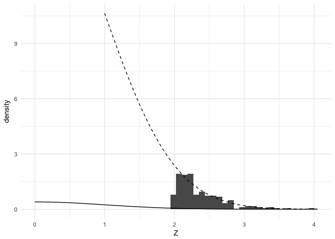
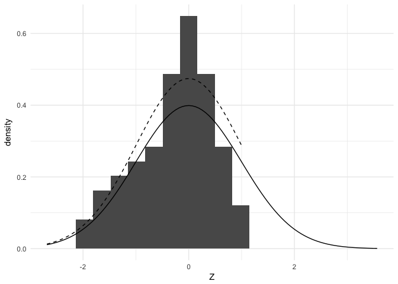

Multiple testing
================
Joshua Loftus
4/2/2020

Modern statistics
=================

For various technological/historical reasons there is a lot more data in our current era than during the period when classical statistical methods were initially developed.

Simplified descriptions:

-   Classical hypothesis testing problem: a **(scientific) theory** derived from previous observations and first principles implies some **experimental hypothesis** *H* about an observable/measurable quantity *X*. This is formalized by introducing a (low-dimensional) parametric probability model for *X* and deriving a **statistical (null) hypothesis** *H*<sub>0</sub> about parameters of this distribution, along with the distribution a test statistic *T* = *T*(*X*) would have assuming *H*<sub>0</sub> is true and, ideally, also under some alternative hypothesis *H*<sub>*A*</sub> (or family of alternatives). Implementation of the testing procedure on real data usually requires solving an optimization problem, possibly with (iterative) numerical algorithms.

-- e.g. Testing the central tendency via a parameter like the mean $\\mu = \\mathbb E\[X\]$ and a hypothesis that it equals some pre-specified value, *H*<sub>0</sub> : *μ* = *μ*<sub>0</sub> vs some other pre-specified value *H*<sub>*A*</sub> : *μ* = *μ*<sub>*A*</sub>, range of values *μ* &gt; *μ*<sub>0</sub>, or union of ranges *μ* ≠ *μ*<sub>0</sub>.

-- e.g. Testing the difference between two central tendencies $\\mu\_X = \\mathbb E\[X\], \\mu\_Y = \\mathbb E\[Y\]$, often a null hypothesis of equality *H*<sub>0</sub> : *μ*<sub>*X*</sub> − *μ*<sub>*Y*</sub> = 0.

-- e.g. Testing the coefficient in a linear model predicting a pre-specified outcome variable *Y* using pre-specified predictor variables *X* combined with some probabilistic assumptions about the errors *ϵ* of the linear model *Y* = *X**β* + *ϵ*.

-   A modern hypothesis testing problem: someone has a large dataset (which we assume is available or easily transformed to a rectangular/spreadsheet format, with many variables/columns, many observations/rows, or both). They might have a vague (scientific) theory, but this theory may be related to many separate hypotheses *H*<sup>1</sup>, *H*<sup>2</sup>, *H*<sup>3</sup>, …, or one vague hypothesis *H* about many of the variables in the dataset, and concerning possibly an unknown subset of them. Most likely there is no single, well-motivated probabilistic model for the data. In this setting it is common to **bet on sparsity**: assume there exists some low-dimensional subset/subspace or representation of the data that satisfies some probabilistic modeling assumptions, and then use optimization algorithms to search for this.

-- e.g. **Simultaneous inference**: we may wish to test statistical hypotheses about each of many variables and provide some kind of statistical guarantee about the combined family of hypotheses, rather than just a separate statistical guarantee for each one individually. For example, we may wish to control the **family-wise error rate** (FWER) which is the probability of making any type 1 errors.

-- e.g. **Selective inference**: select a subset of the hypotheses and provide some statistical guarantee that applies only to the selected subset. For example, we may wish to control the **false discovery rate** which is the expected proportion of type 1 errors in the selected set.

-- e.g. **High-dimensional (linear) regression**: select a subset of variables to predict a pre-specified outcome variable in a linear model, and provide inferences for the selected predictors using some appropriately modified type of statistical guarantee.

-- e.g. **Machine learning**: a variety of predictive approaches which relax the linear modeling assumption in some way, but may be used in combination with some assumptions that allow interpretable inference about some hypotheses concerning parts of the model.

Multiple testing
================

The context
-----------

In this notebook we focus on problems related to testing many hypotheses. We do not assume these hypotheses are related to a linear regression model. Instead, we are usually thinking of these hypotheses as tests of many separate effects. As a canonical example we can think of genome association studies, where test *j* corresponds to some measure of association between variation at some location *L*<sub>*j*</sub> on the genome with a pre-chosen outcome of interest. The outcome could be membership to a particular group, like a treatment or exposure group compared to a control or placebo group, in which case test *j* may be a two-sample test for similarity/equality at *L*<sub>*j*</sub> between the groups.

Mathematically, we assume for *j* = 1, …, *p* we have test statistics *T*<sub>*j*</sub> for testing the hypothesis

*H*<sub>0, *j*</sub> : *θ*<sub>*j*</sub> = *θ*<sub>0, *j*</sub>
 such that if *H*<sub>0, *j*</sub> is true then *T*<sub>*j*</sub> has a known distribution with cumulative distribution function *F*<sub>*j*</sub>(*t*). Hence, *p*<sub>*j*</sub> := *F*<sub>*j*</sub>(*T*<sub>*j*</sub>) is a valid *p*-value in the sense that *p*<sub>*j*</sub> ∼ *U*\[0, 1\] if *H*<sub>0, *j*</sub> is true. As usual in hypothesis testing, we first focus on controlling Type 1 error. So while we do not assume anything more about *T*<sub>*j*</sub> for now, we have in the back of our minds the expectation that *p*<sub>*j*</sub> will be stochastically smaller than *U*\[0, 1\] under some alternative *H*<sub>*A*, *j*</sub> of interest, so that the tests will have some power.

The general problem
-------------------

More tests means more opportunities for errors! If we publish papers or reports throughout our career with one hypothesis test each, we may hope that only 5% (say) of these works contain errors. But if each of our publications have at least 10 independent tests where the null hypotheses are true, then there is at least 40% probability of having at least one Type 1 error, hence we would expect at least 40% of our works to contain some errors.

We have several options

-   Lower our standards and accept that nearly every piece of work we're responsible for will have have (a high probability of containing) multiple errors

-   Test fewer hypotheses in each study, perhaps limiting to only one (and potentially suffer the professional costs of publication rejection if our only test comes back negative)

-   Modify our use of statistical methods to achieve some type of error control that holds across all of the multiple tests in any individual study

Hopefully it's already obvious that we will pursue the third option.

(Note: in practice there may be some other criteria for choosing which tests to group together which is more nuanced or better motivated than whether they're appearing in the same study, but resolving this question usually takes us into the realm of domain specific knowledge)

``` r
library(tidyverse)
```

One data generation example
---------------------------

Assume our goal is to test *H*<sub>0, *i*</sub> : *μ*<sub>*i*</sub> = 0 against *H*<sub>*A*, *i*</sub> : *μ*<sub>*i*</sub> &lt; 0 using the data

*z*<sub>*i*</sub> ∼ *N*(*μ*<sub>*i*</sub>, 1)

Suppose the first 10 effects are nonzero, and the remaining *p* − 10 are null. To keep things simple for now we will also assume the hypotheses are distinct and test statistics are independent.

We generate an example dataset below and transform the test statistics to *p*-values for the two-sided alternatives:

``` r
set.seed(1)
p <- 100
threshold <- 1.1*sqrt(2*log(p))
mu <- c(rep(-threshold, 10), rep(0, p - 10))
instance <- function(p, mu) {
  z <- rnorm(p) + mu
  p <- 2*(1-pnorm(abs(z))) # twice the one-sided upper tail area
  p
}
```

Now let's check to see which *p*-values are significant at the 5% level

``` r
pvalues <- instance(p, mu)
which(pvalues < 0.05)
```

    ##  [1]  1  2  3  5  6  7  8  9 10 14 24 56 61 70

We correctly find 9 of the 10 truly nonzero effects, but we also make several Type 1 errors. Here's another instance:

``` r
pvalues <- instance(p, mu)
which(pvalues < 0.05)
```

    ##  [1]  1  2  3  4  5  7  8  9 47 66 71 78

Now let's repeat the experiment many times and see (1) how often we make any Type 1 errors, and (2) the average number of Type 1 errors

``` r
experiment <- function(p, mu) {
  pvalues <- instance(p, mu)
  at_least_one <- any(pvalues[11:p] < 0.05)
  how_many <- sum(pvalues[11:p] < 0.05)
  c(at_least_one, how_many)
}
rowMeans(replicate(100, experiment(p, mu)))
```

    ## [1] 0.99 5.02

About 99% of the time we make at least one Type 1 error, and on average we make about 5 Type 1 errors (the expected number of Type 1 errors from the Bin(90, 0.05) distribution is 4.5).

Now let's consider statistical methods to address this problem.

Solution approaches
-------------------

There are many methods for various multiple testing problems, and at a high level these can be classified based on what type of error criterion they aim to control (instead of aiming to control Type 1 error for each test separately).

### Family-wise error rate

For tests of the collection of hypotheses *H* = {*H*<sub>0, *j*</sub>, *j* = 1, …, *p*} the family-wise error rate of a testing procedure *T* is the probability of making any Type 1 errors

$$
\\text{FWER} = \\text{FWER}(T; H) = \\mathbb P\_H(T \\text{ commits at least one Type 1 error})
$$
 This is a very strict error criterion, typically requiring a high standard of evidence to declare significance. As a result, it may result in low power (high Type 2 error) to detect small or moderately sized non-null effects.

#### Bonferroni-Dunn correction

This correction is based on the union bound. As a result, it works (controls FWER) under arbitrary dependence, and does not require the tests or *p*-values are independent. The procedure works as follows: reject *H*<sub>0, *j*</sub> at significance level *α* if *p*<sub>*j*</sub> &lt; *α*/*p*. Let *E*<sub>*j*</sub> = {Test *j* commits a Type 1 error}, so $\\mathbb P\_H(E\_j) \\leq \\alpha/p$.

$$
FWER = \\mathbb P\_H \\left( \\bigcup\_{j=1}^p E\_j \\right) \\leq \\sum\_{j=1}^p \\mathbb P\_H(E\_j) \\leq \\sum\_{j=1}^p \\frac{\\alpha}{p} = \\alpha
$$

These are less than alpha iff original p-values are less than alpha/n

``` r
which(p.adjust(pvalues, method = "bonferroni") < 0.05)
```

    ## [1] 1 3 5

#### Holm correction

These are less than alpha iff original p-values are less than alpha/n

``` r
which(p.adjust(pvalues, method = "holm") < 0.05)
```

    ## [1] 1 3 5

### False discovery rate

#### Benjamini-Hochberg correction

Control FDR

These are less than alpha iff original p-values are less than alpha/n

``` r
which(p.adjust(pvalues, method = "BH") < 0.05)
```

    ## [1] 1 2 3 4 5

Simulation
----------

### FWER

``` r
instance <- function(p, sparsity, threshold) {
  mu <- c(rep(-threshold, sparsity), rep(0, p - sparsity))
  z <- rnorm(p) + mu
  pvalues <- pnorm(z)
  adj_pvalues <- p.adjust(pvalues, method = "bonferroni")
  discoveries <- which(adj_pvalues < 0.05)
  true_discoveries <- sum(discoveries <= sparsity)
  false_discoveries <- sum(discoveries > sparsity)
  return(c(true_discoveries, false_discoveries))
}
```

``` r
mc_sample <- replicate(1000, instance(1000, 10, sqrt(2*log(1000))))
```

``` r
rowMeans(mc_sample)
```

    ## [1] 4.307 0.048

FWER:

``` r
mean(mc_sample[2, ] > 0)
```

    ## [1] 0.047

### FDR

``` r
instance <- function(p, sparsity, threshold) {
  mu <- c(rep(-threshold, sparsity), rep(0, p - sparsity))
  z <- rnorm(p) + mu
  pvalues <- pnorm(z)
  adj_pvalues <- p.adjust(pvalues, method = "BH")
  discoveries <- which(adj_pvalues < 0.05)
  true_discoveries <- sum(discoveries <= sparsity)
  false_discoveries <- sum(discoveries > sparsity)
  return(c(true_discoveries, false_discoveries))
}
```

``` r
mc_sample <- replicate(1000, instance(1000, 10, sqrt(2*log(1000))))
```

``` r
rowMeans(mc_sample)
```

    ## [1] 6.243 0.396

Checking FDR?

``` r
mean(mc_sample[2, ]/pmax(colSums(mc_sample), 1))
```

    ## [1] 0.0500039

How can we cheat the FDR?
-------------------------

Make the denominator smaller without increasing numerator -- i.e. adding in many true discoveries (known a priori to be true discoveries)

``` r
p <- 1000
threshold <- 1.1*sqrt(2*log(p))
mu <- c(rep(-threshold, 10), rep(0, p - 10))
z <- rnorm(p) + mu
pvalues <- pnorm(z)
```

Control FDR

These are less than alpha iff original p-values are less than alpha/n

``` r
pvalues <- c(pvalues, rep(0.00001, 100))
which(p.adjust(pvalues, method = "BH") < 0.05)
```

    ##   [1]    1    2    3    4    5    6    7    8    9   10   35  251  571  720
    ##  [15]  803  831  911 1001 1002 1003 1004 1005 1006 1007 1008 1009 1010 1011
    ##  [29] 1012 1013 1014 1015 1016 1017 1018 1019 1020 1021 1022 1023 1024 1025
    ##  [43] 1026 1027 1028 1029 1030 1031 1032 1033 1034 1035 1036 1037 1038 1039
    ##  [57] 1040 1041 1042 1043 1044 1045 1046 1047 1048 1049 1050 1051 1052 1053
    ##  [71] 1054 1055 1056 1057 1058 1059 1060 1061 1062 1063 1064 1065 1066 1067
    ##  [85] 1068 1069 1070 1071 1072 1073 1074 1075 1076 1077 1078 1079 1080 1081
    ##  [99] 1082 1083 1084 1085 1086 1087 1088 1089 1090 1091 1092 1093 1094 1095
    ## [113] 1096 1097 1098 1099 1100

Selective inference for marginal screening
------------------------------------------

``` r
C <- 2
p <- 10000
Z <- rnorm(p)
selected_Z <- selected_Z <- data.frame(Z = Z[Z > C])
nrow(selected_Z)/p
```

    ## [1] 0.0227

``` r
mean(selected_Z$Z > qnorm(.95))
```

    ## [1] 1

``` r
truncated_Z_pdf <- function(z) dnorm(z)/pnorm(C, lower.tail = F)
# plot code hidden
```

``` r
maxZ <- max(Z) + .1
ggplot(selected_Z) +
  geom_histogram(bins = 50, aes(x = Z, y = ..density..)) + xlim(0, maxZ) +
  stat_function(fun = truncated_Z_pdf, xlim = c(1, maxZ), linetype  = 2) +
  stat_function(fun = dnorm, linetype  = 1) +
  theme_minimal()
```



Cutoff for significance

``` r
pnorm(3.05, lower.tail = FALSE)/pnorm(C, lower.tail = FALSE)
```

    ## [1] 0.05029451

Larger than:

``` r
qnorm(.95)
```

    ## [1] 1.644854

``` r
mean(selected_Z$Z > 3.05)
```

    ## [1] 0.05286344

This controls the **selective type 1 error**

Power
-----

``` r
C <- 1
p <- 100
mu <- c(rep(1, 10), rep(0, p - 10))
Z <- rnorm(p) + mu
selection_index <- Z > C
which(selection_index)
```

    ##  [1]  1  2  3  4  5  6  7 10 13 24 28 34 37 42 52 53 54 74 76 77 80 83 94
    ## [24] 95 96

``` r
which(Z[selection_index] > qnorm(.95))
```

    ##  [1]  1  3  4  5  9 11 12 13 14 22 23 24

Cutoff for significance

``` r
pnorm(2.41, lower.tail = FALSE)/pnorm(C, lower.tail = FALSE)
```

    ## [1] 0.05027416

``` r
which(Z[selection_index] > 2.41)
```

    ## [1] 11 12 23

Testing the non-selected effects to determine if we should do any follow-up on them in future studies

``` r
truncated_Z_pdf <- function(z) dnorm(z)/pnorm(C)
# plot code hidden
```

``` r
unselected_Z <- selected_Z <- data.frame(Z = Z[Z < C])
maxZ <- min(Z) - .1
ggplot(unselected_Z) +
  geom_histogram(bins = 20, aes(x = Z, y = ..density..)) + xlim(maxZ, max(Z) + .1) +
  stat_function(fun = truncated_Z_pdf, xlim = c(maxZ, C), linetype  = 2) +
  stat_function(fun = dnorm, linetype  = 1) +
  theme_minimal()
```

    ## Warning: Removed 1 rows containing missing values (geom_bar).



``` r
pnorm(.84)/pnorm(C)
```

    ## [1] 0.9503189

``` r
which(unselected_Z > .84)
```

    ## [1] 59 61

Bonferroni correction after selection
-------------------------------------

``` r
C <- 2
p <- 10000
Z <- rnorm(p)
selected_Z <- selected_Z <- data.frame(Z = Z[Z > C])
nrow(selected_Z)/p
```

    ## [1] 0.0239

``` r
mean(selected_Z$Z > qnorm(.95))
```

    ## [1] 1
