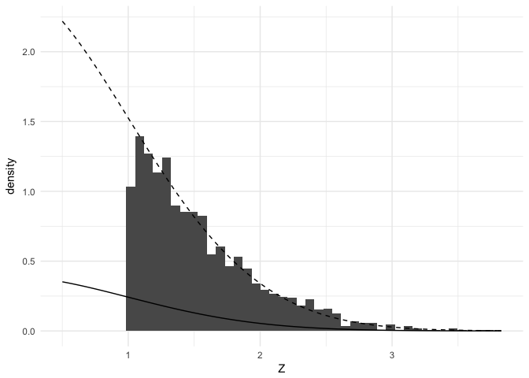

Multiple testing
================
Joshua Loftus
4/2/2020

Modern statistics
=================

For various technological/historical reasons there is a lot more data in our current era than during the period when classical statistical methods were initially developed.

Simplified descriptions:

-   Classical hypothesis testing problem: a **(scientific) theory** derived from previous observations and first principles implies some **experimental hypothesis** *H* about an observable/measurable quantity *X*. This is formalized by introducing a (low-dimensional) parametric probability model for *X* and deriving a **statistical (null) hypothesis** *H*<sub>0</sub> about parameters of this distribution, along with the distribution a test statistic *T* = *T*(*X*) would have assuming *H*<sub>0</sub> is true and, ideally, also under some alternative hypothesis *H*<sub>*A*</sub> (or family of alternatives). Implementation of the testing procedure on real data usually requires solving an optimization problem, possibly with (iterative) numerical algorithms.

-   e.g. Testing the central tendency via a parameter like the mean $\\mu = \\mathbb E\[X\]$ and a hypothesis that it equals some pre-specified value, *H*<sub>0</sub> : *μ* = *μ*<sub>0</sub> vs some other pre-specified value *H*<sub>*A*</sub> : *μ* = *μ*<sub>*A*</sub>, range of values *μ* &gt; *μ*<sub>0</sub>, or union of ranges *μ* ≠ *μ*<sub>0</sub>.

-   e.g. Testing the difference between two central tendencies $\\mu\_X = \\mathbb E\[X\], \\mu\_Y = \\mathbb E\[Y\]$, often a null hypothesis of equality *H*<sub>0</sub> : *μ*<sub>*X*</sub> − *μ*<sub>*Y*</sub> = 0.

-   e.g. Testing the coefficient in a linear model predicting a pre-specified outcome variable *Y* using pre-specified predictor variables *X* combined with some probabilistic assumptions about the errors *ϵ* of the linear model *Y* = *X**β* + *ϵ*.

-   A modern hypothesis testing problem: someone has a large dataset (which we assume is available or easily transformed to a rectangular/spreadsheet format, with many variables/columns, many observations/rows, or both). They might have a vague (scientific) theory, but this theory may be related to many separate hypotheses *H*<sup>1</sup>, *H*<sup>2</sup>, *H*<sup>3</sup>, …, or one vague hypothesis *H* about many of the variables in the dataset, and concerning possibly an unknown subset of them. Most likely there is no single, well-motivated probabilistic model for the data. In this setting it is common to **bet on sparsity**: assume there exists some low-dimensional subset/subspace or representation of the data that satisfies some probabilistic modeling assumptions, and then use optimization algorithms to search for this.

-   e.g. **Simultaneous inference**: we may wish to test statistical hypotheses about each of many variables and provide some kind of statistical guarantee about the combined family of hypotheses, rather than just a separate statistical guarantee for each one individually. For example, we may wish to control the **family-wise error rate** (FWER) which is the probability of making any type 1 errors.

-   e.g. **Selective inference**: select a subset of the hypotheses and provide some statistical guarantee that applies only to the selected subset. For example, we may wish to control the **false discovery rate** which is the expected proportion of type 1 errors in the selected set.

-   e.g. **High-dimensional (linear) regression**: select a subset of variables to predict a pre-specified outcome variable in a linear model, and provide inferences for the selected predictors using some appropriately modified type of statistical guarantee.

-   e.g. **Machine learning**: a variety of predictive approaches which relax the linear modeling assumption in some way, but may be used in combination with some assumptions that allow interpretable inference about some hypotheses concerning parts of the model.

Multiple testing
================

The context
-----------

In this notebook we focus on problems related to testing many hypotheses. We do not assume these hypotheses are related to a linear regression model. Instead, we are usually thinking of these hypotheses as tests of many separate effects. As a canonical example we can think of genome association studies, where test *j* corresponds to some measure of association between variation at some location *L*<sub>*j*</sub> on the genome with a pre-chosen outcome of interest. The outcome could be membership to a particular group, like a treatment or exposure group compared to a control or placebo group, in which case test *j* may be a two-sample test for similarity/equality at *L*<sub>*j*</sub> between the groups.

Mathematically, we assume for *j* = 1, …, *p* we have test statistics *T*<sub>*j*</sub> for testing the hypothesis

*H*<sub>0, *j*</sub> : *θ*<sub>*j*</sub> = *θ*<sub>0, *j*</sub>
 such that if *H*<sub>0, *j*</sub> is true then *T*<sub>*j*</sub> has a known distribution with cumulative distribution function *F*<sub>*j*</sub>(*t*). Hence, *p*<sub>*j*</sub> := *F*<sub>*j*</sub>(*T*<sub>*j*</sub>) is a valid *p*-value in the sense that *p*<sub>*j*</sub> ∼ *U*\[0, 1\] if *H*<sub>0, *j*</sub> is true. As usual in hypothesis testing, we first focus on controlling Type 1 error. So while we do not assume anything more about *T*<sub>*j*</sub> for now, we have in the back of our minds the expectation that *p*<sub>*j*</sub> will be stochastically smaller than *U*\[0, 1\] under some alternative *H*<sub>*A*, *j*</sub> of interest, so that the tests will have some power.

The general problem
-------------------

More tests means more opportunities for errors! If we publish papers or reports throughout our career with one hypothesis test each, we may hope that only 5% (say) of these works contain errors. But if each of our publications have at least 10 independent tests where the null hypotheses are true, then there is at least 40% probability of having at least one Type 1 error, hence we would expect at least 40% of our works to contain some errors.

We have several options

-   Lower our standards and accept that nearly every piece of work we're responsible for will have have (a high probability of containing) multiple errors

-   Test fewer hypotheses in each study, perhaps limiting to only one (and potentially suffer the professional costs of publication rejection if our only test comes back negative)

-   Modify our use of statistical methods to achieve some type of error control that holds across all of the multiple tests in any individual study

Hopefully it's already obvious that we will pursue the third option.

(Note: in practice there may be some other criteria for choosing which tests to group together which is more nuanced or better motivated than whether they're appearing in the same study, but resolving this question usually takes us into the realm of domain specific knowledge)

``` r
library(tidyverse)
```

One data generation example
---------------------------

Assume our goal is to test *H*<sub>0, *i*</sub> : *μ*<sub>*i*</sub> = 0 against *H*<sub>*A*, *i*</sub> : *μ*<sub>*i*</sub> &lt; 0 using the data

*z*<sub>*i*</sub> ∼ *N*(*μ*<sub>*i*</sub>, 1)

Suppose the first 10 effects are nonzero, and the remaining *p* − 10 are null. To keep things simple for now we will also assume the hypotheses are distinct and test statistics are independent.

We generate an example dataset below and transform the test statistics to *p*-values for the two-sided alternatives:

``` r
set.seed(1)
p <- 100
threshold <- 1.1*sqrt(2*log(p))
mu <- c(rep(-threshold, 10), rep(0, p - 10))
instance <- function(p, mu) {
  z <- rnorm(p) + mu
  p <- 2*(1-pnorm(abs(z))) # twice the one-sided upper tail area
  p
}
```

Now let's check to see which *p*-values are significant at the 5% level

``` r
pvalues <- instance(p, mu)
which(pvalues < 0.05)
```

    ##  [1]  1  2  3  5  6  7  8  9 10 14 24 56 61 70

We correctly find 9 of the 10 truly nonzero effects, but we also make several Type 1 errors. Here's another instance:

``` r
pvalues <- instance(p, mu)
which(pvalues < 0.05)
```

    ##  [1]  1  2  3  4  5  7  8  9 47 66 71 78

Now let's repeat the experiment many times and see (1) how often we make any Type 1 errors, and (2) the average number of Type 1 errors

``` r
experiment <- function(p, mu) {
  pvalues <- instance(p, mu)
  at_least_one <- any(pvalues[11:p] < 0.05)
  how_many <- sum(pvalues[11:p] < 0.05)
  c(at_least_one, how_many)
}
rowMeans(replicate(100, experiment(p, mu)))
```

    ## [1] 0.99 5.02

About 99% of the time we make at least one Type 1 error, and on average we make about 5 Type 1 errors (the expected number of Type 1 errors from the Bin(90, 0.05) distribution is 4.5).

Now we consider statistical methods to address this problem.

Solution approaches
-------------------

There are many methods for various multiple testing problems, and at a high level these can be classified based on what type of error criterion they aim to control (instead of aiming to control Type 1 error for each test separately).

### Family-wise error rate

For tests of the collection of hypotheses *H* = {*H*<sub>0, *j*</sub>, *j* = 1, …, *p*} the family-wise error rate of a testing procedure *T* is the probability of making any Type 1 errors

$$
\\text{FWER} = \\text{FWER}(T; H) = \\mathbb P\_H(T \\text{ commits at least one Type 1 error})
$$
 This is a very strict error criterion, typically requiring a high standard of evidence to declare significance. As a result, it may result in low power (high Type 2 error) to detect small or moderately sized non-null effects.

#### Bonferroni-Dunn correction

This correction is based on the union bound. As a result, it works (controls FWER) under arbitrary dependence, and does not require the tests or *p*-values are independent. The procedure works as follows: reject *H*<sub>0, *j*</sub> at significance level *α* if *p*<sub>*j*</sub> &lt; *α*/*p*. Let *E*<sub>*j*</sub> = {Test *j* commits a Type 1 error}, so $\\mathbb P\_H(E\_j) \\leq \\alpha/p$.

$$
FWER = \\mathbb P\_H \\left( \\bigcup\_{j=1}^p E\_j \\right) \\leq \\sum\_{j=1}^p \\mathbb P\_H(E\_j) \\leq \\sum\_{j=1}^p \\frac{\\alpha}{p} = \\alpha
$$

These are less than alpha iff original p-values are less than alpha/p.

``` r
which(p.adjust(pvalues, method = "bonferroni") < 0.05)
```

    ## [1] 1 3 5

``` r
which(pvalues < 0.05/p)
```

    ## [1] 1 3 5

#### Holm correction

This correction is very similar to Bonferroni-Dunn but has a slight improvement in power (lower Type 2 erro)

``` r
which(p.adjust(pvalues, method = "holm") < 0.05)
```

    ## [1] 1 3 5

#### Pros/cons

-   Pro: Because the Bonferroni-Dunn correction is based on the extremely general union bound it works (in the sense of controlling FWER) even if the tests are dependent.
-   Con: This approach is conservative, especially if the number of tests is large. Effect sizes must be asymptotically larger than $\\sqrt{2\\log(p)}$ to be detected. This means that effects which may be large enough for very high power when tested individually may have very low power when combined with many other tests.

We can break this method, increasing its Type 2 error (reducing its power) by including more tests in the analysis than necessary. If we add many tests of hypotheses which are known *a priori* to be null (for example by generating data randomly) we can make it impossible to detect true non-null effects.

### False discovery rate

Proposed by Benjamini and Hochberg in 1995, controlling the FDR has become a widespread alternative to the FWER in part because it is less conservative. There are many settings where doing many tests is essentially unavoidable, and controlling the FWER would also make it nearly impossible to discover any non-null effects. Scientists working with genomic data, for example, have adopted the FDR as an alternative which allows them to make more discoveries than the FWER.

-   FDR is less strict than FWER, hence may have more power
-   Controlling FWER implies control of FDR, but not conversely

Controlling the FDR means that among the tests which are declared significant we expect the proportion of these which are false-discoveries to be low. Mathematically, if *V* is the number of false discoveries (nulls declared to be significant) and *S* the number of true discoveries (non-nulls declared significant), and *R* = *V* + *S* is the number of tests declared significant, then the (observed) *false discovery proportion* is

$$
\\text{FDP} = \\frac{V}{V+S} = \\frac{V}{R}
$$
 Instead of controlling the probability of Type 1 errors, we try to control the expectation of the FDP. For a fixed level *q* &gt; 0 (it is customary to use *q* instead of *α*) we want procedures deciding which tests are significant to satisfy

$$
\\mathbb E\[\\text{FDP}\] \\leq q
$$

When our procedures declare a set of the tests significant, we want most (1 − *q* proportion) of these to be truly non-null, i.e. true discoveries.

Let's assume that such a procedure will take *p*-values as inputs, then our first intuition might be to sort these *p*-values and choose the hypotheses with the lowest *p*-values to declare significant. This is actually how many such procedures function, traversing the list of sorted *p*-values from low to high or from high to low, and the next key question to resolve is where to stop. After stopping at some point, the procedure declares all the hypotheses with *p*-values lower than that stopping point to be discoveries.

#### Benjamini-Hochberg correction

Let *p*<sub>(1)</sub> ≤ *p*<sub>(2)</sub> ≤ ⋯ ≤ *p*<sub>(*p*)</sub> be the sorted list of *p*-values. The Benjamini-Hochberg procedure finds the *largest* *j* such that *p*<sub>(*j*)</sub> ≤ *q**j*/*p*, and rejects the corresponding hypothesis along all the hypotheses with smaller *p*-values than this one.

The `p.adjust` function converts the original *p*-values to adjusted versions which are less or equal to *q* if and only if the corresponding hypothesis would be selected as a discovery by the BH procedure. Here's an example with several values of *q*

``` r
which(p.adjust(pvalues, method = "BH") < 0.05)
```

    ## [1] 1 2 3 4 5

``` r
which(p.adjust(pvalues, method = "BH") < 0.1)
```

    ## [1] 1 2 3 4 5 9

``` r
which(p.adjust(pvalues, method = "BH") < 0.2)
```

    ## [1] 1 2 3 4 5 7 8 9

If we are satisfied with allowing as high as 20% of our discoveries to be mistakes, we have much greater power (compared to Bonferroni-Dunn) to discover the truly non-null effects.

#### Benjamini-Yekutieli

The BH procedure requires either independence of the tests or a certain technical kind of dependency. There are some types of dependence which can break the procedure. However, there is a modified version called the Benjamini-Hochberg-Yekutieli or Benjamini-Yekutieli (BY) procedure which controls the FDR under arbitrary dependence at the cost of a loss in power. Compare the discoveries of BH above to BY, with *q* = 0.2 for both:

``` r
which(p.adjust(pvalues, method = "BY") < 0.2)
```

    ## [1] 1 2 3 4 5

The BY procedure is still more powerful than controlling the FWER.

#### Pros/cons

-   Pro: Controlling FDR allows more discoveries than controlling FWER
-   Pro: The BH procedure tends to control FDR quite robustly, even when dependence assumptions are violated
-   Con: The BH procedure may be more conservative under dependence
-   Con: Since it does not control FWER, this means each of our individual studies will be likely to contain at least one error

We can "break" the FDR, in the sense of allowing a larger absolute number of false discoveries, by making the denominator of the FDP smaller without increasing the numerator -- i.e. adding in many effects known *a priori* to be true discoveries with very small *p*-values.

``` r
pvalues <- c(pvalues, rep(0.00001, 100))
discoveries <- which(p.adjust(pvalues, method = "BH") < 0.1)
discoveries[discoveries <= 100]
```

    ##  [1]  1  2  3  4  5  7  8  9 41 47 66 71 78

Ignoring the newly added hypotheses, the FDP among only the original ones is now much higher than *q* = 0.1.

In other words, there is a danger for potentially deceptive use of this method which we must guard against. (Reasoning in a *roughly* subjective Bayesian fashion, if we think someone has included more hypotheses *H*<sup>cheat</sup> with a high prior probability of large effects, then we should have a lower posterior probability for any other new hypotheses discovered in the combined analysis).

> The value of this method is to help focus the scientific process. Ideally the process will continue collecting more data and conducting follow-up studies on the selected hypotheses, eventually ruling out the small(er) proportion of which were false discoveries. And ideally, hypotheses which were not selected in one study may be eligible for follow-up as well, because their failure to be selected could potentially be a false negative.

### Selective inference for marginal screening

The FDR provides a statistical guarantee for the set of selected hypotheses, but it is also possible to ask for selective guarantees that hold on each of the selected hypotheses individually. In this example we consider a selection rule which is different from the BH procedure, a rule which was not designed to provide any statistical guarantee for the selected set. This rule is simple: select effects with *z*-scores above a pre-determined threshold *C*.

We focus on controlling Type 1 errors in a certain sense, so we'll generate data where every effect is null.

``` r
C <- 1
p <- 10000
Z <- rnorm(p)
selected_Z <- selected_Z <- data.frame(Z = Z[Z > C])
nrow(selected_Z)/p
```

    ## [1] 0.1555

Since every effect is null we expect a proportion of 1 − *Φ*(*C*) of them to fall above the threshold *C*. Now, if we do a 1 sided test against the upper tail alternative for these let's see the proportion of these which yield Type 1 errors:

``` r
mean(selected_Z$Z > qnorm(.95))
```

    ## [1] 0.3247588

This is much higher than 5%, an example of selection bias.

#### Conditional (truncated) distribution

``` r
truncated_Z_pdf <- function(z) dnorm(z)/pnorm(C, lower.tail = F)
maxZ <- max(Z) + .1
minZ <- min(selected_Z$Z) - .5
ggplot(selected_Z) +
  geom_histogram(bins = 50, aes(x = Z, y = ..density..)) + xlim(minZ, maxZ) +
  stat_function(fun = truncated_Z_pdf, xlim = c(minZ, maxZ), linetype  = 2) +
  stat_function(fun = dnorm, linetype  = 1) +
  theme_minimal()
```

    ## Warning: Removed 1 rows containing missing values (geom_bar).



Cutoff for significance (solving for it numerically with the `uniroot` function)

``` r
trunc_cutoff <- function(C, alpha = 0.05) {
  TZcdf <- function(z) pnorm(z, lower.tail = FALSE)/pnorm(C, lower.tail = FALSE)
  uniroot(function(z) TZcdf(z) - alpha, lower = C, upper = 10*C)$root
}
cutoff <- trunc_cutoff(C)
cutoff
```

    ## [1] 2.411994

This is larger than:

``` r
qnorm(.95)
```

    ## [1] 1.644854

Meaning the cutoff for significance is more strict. We can check that this larger cutoff does control Type 1 error on the selected effects:

``` r
mean(selected_Z$Z > cutoff)
```

    ## [1] 0.05659164

This controls the **selective type 1 error**, which is nothing more than the usual Type 1 error applied conditionally on being selected:

$$
\\mathbb P\_{H\_{0,j}}(\\text{reject } H\_{0,j}|\\text{selecting hypothesis } j \\text{ to test}) \\leq \\alpha
$$

#### Pros/cons

-   Pro: Corrects selection bias, which may help improve reproducibility for the effects which are declared significant.
-   Con: The more strict standard for significance means we will have lower power:

``` r
C <- 1
p <- 100
mu <- c(rep(2, 10), rep(0, p - 10))
Z <- rnorm(p) + mu
selection_index <- Z > C
which(selection_index)
```

    ##  [1]  2  3  5  6  7  8  9 11 19 25 27 38 60 63 64 73 79 91 93 96 98

``` r
which(Z[selection_index] > qnorm(.95))
```

    ## [1]  1  2  4  5  6  7  8 20

``` r
which(Z[selection_index] > trunc_cutoff(C))
```

    ## [1] 1 5 6 7

### Bonferroni correction after selection

``` r
P_selected <- length(selection_index)
pvalues <- pnorm(Z, lower.tail = FALSE)
which(pvalues[selection_index] < 0.05/P_selected)
```

    ## integer(0)
