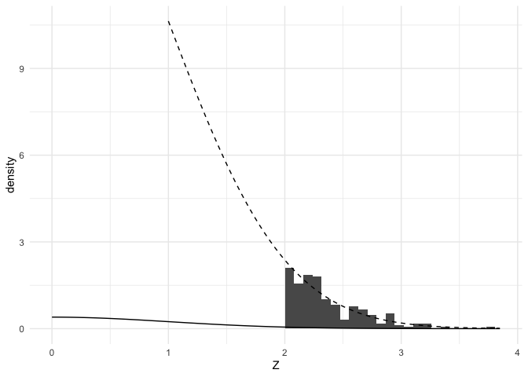
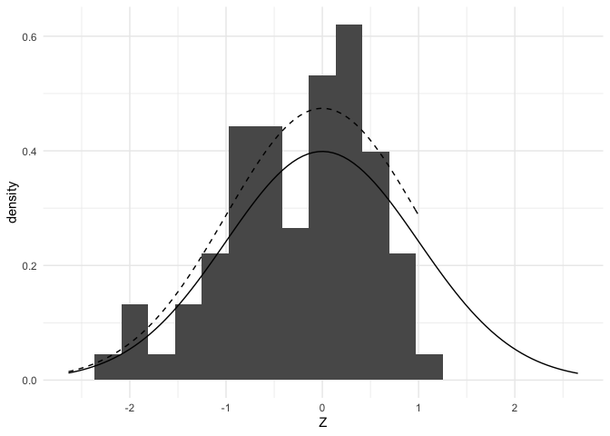

Multiple testing
================
Joshua Loftus
4/2/2020

Data generation
---------------

Assume
*z*<sub>*i*</sub> ∼ *N*(*μ*<sub>*i*</sub>, 1)
 Our goal is to test *H*<sub>0, *i*</sub> : *μ*<sub>*i*</sub> = 0 against *H*<sub>*A*, *i*</sub> : *μ*<sub>*i*</sub> &lt; 0.

``` r
p <- 1000
threshold <- 1.1*sqrt(2*log(p))
mu <- c(rep(-threshold, 10), rep(0, p - 10))
z <- rnorm(p) + mu
pvalues <- pnorm(z)
```

Bonferroni-Dunn correction
--------------------------

Control FWER

These are less than alpha iff original p-values are less than alpha/n

``` r
which(p.adjust(pvalues, method = "bonferroni") < 0.05)
```

    ## [1] 1 2 4 9

Holm correction
---------------

Control FWER

These are less than alpha iff original p-values are less than alpha/n

``` r
which(p.adjust(pvalues, method = "holm") < 0.05)
```

    ## [1] 1 2 4 9

Benjamini-Hochberg correction
-----------------------------

Control FDR

These are less than alpha iff original p-values are less than alpha/n

``` r
which(p.adjust(pvalues, method = "BH") < 0.05)
```

    ## [1]  1  2  4  7  9 10

Simulation
----------

### FWER

``` r
instance <- function(p, sparsity, threshold) {
  mu <- c(rep(-threshold, sparsity), rep(0, p - sparsity))
  z <- rnorm(p) + mu
  pvalues <- pnorm(z)
  adj_pvalues <- p.adjust(pvalues, method = "bonferroni")
  discoveries <- which(adj_pvalues < 0.05)
  true_discoveries <- sum(discoveries <= sparsity)
  false_discoveries <- sum(discoveries > sparsity)
  return(c(true_discoveries, false_discoveries))
}
```

``` r
mc_sample <- replicate(1000, instance(1000, 10, sqrt(2*log(1000))))
```

``` r
rowMeans(mc_sample)
```

    ## [1] 4.304 0.045

FWER:

``` r
mean(mc_sample[2, ] > 0)
```

    ## [1] 0.042

### FDR

``` r
instance <- function(p, sparsity, threshold) {
  mu <- c(rep(-threshold, sparsity), rep(0, p - sparsity))
  z <- rnorm(p) + mu
  pvalues <- pnorm(z)
  adj_pvalues <- p.adjust(pvalues, method = "BH")
  discoveries <- which(adj_pvalues < 0.05)
  true_discoveries <- sum(discoveries <= sparsity)
  false_discoveries <- sum(discoveries > sparsity)
  return(c(true_discoveries, false_discoveries))
}
```

``` r
mc_sample <- replicate(1000, instance(1000, 10, sqrt(2*log(1000))))
```

``` r
rowMeans(mc_sample)
```

    ## [1] 6.277 0.389

Checking FDR?

``` r
mean(mc_sample[2, ]/pmax(colSums(mc_sample), 1))
```

    ## [1] 0.04840085

How can we cheat the FDR?
-------------------------

Make the denominator smaller without increasing numerator -- i.e. adding in many true discoveries (known a priori to be true discoveries)

``` r
p <- 1000
threshold <- 1.1*sqrt(2*log(p))
mu <- c(rep(-threshold, 10), rep(0, p - 10))
z <- rnorm(p) + mu
pvalues <- pnorm(z)
```

Control FDR

These are less than alpha iff original p-values are less than alpha/n

``` r
pvalues <- c(pvalues, rep(0.00001, 100))
which(p.adjust(pvalues, method = "BH") < 0.05)
```

    ##   [1]    1    2    3    5    6    7    8    9   10  238  484  651  748 1001 1002
    ##  [16] 1003 1004 1005 1006 1007 1008 1009 1010 1011 1012 1013 1014 1015 1016 1017
    ##  [31] 1018 1019 1020 1021 1022 1023 1024 1025 1026 1027 1028 1029 1030 1031 1032
    ##  [46] 1033 1034 1035 1036 1037 1038 1039 1040 1041 1042 1043 1044 1045 1046 1047
    ##  [61] 1048 1049 1050 1051 1052 1053 1054 1055 1056 1057 1058 1059 1060 1061 1062
    ##  [76] 1063 1064 1065 1066 1067 1068 1069 1070 1071 1072 1073 1074 1075 1076 1077
    ##  [91] 1078 1079 1080 1081 1082 1083 1084 1085 1086 1087 1088 1089 1090 1091 1092
    ## [106] 1093 1094 1095 1096 1097 1098 1099 1100

Selective inference for marginal screening
------------------------------------------

``` r
C <- 2
p <- 10000
Z <- rnorm(p)
selected_Z <- selected_Z <- data.frame(Z = Z[Z > C])
nrow(selected_Z)/p
```

    ## [1] 0.0213

``` r
mean(selected_Z$Z > qnorm(.95))
```

    ## [1] 1

``` r
truncated_Z_pdf <- function(z) dnorm(z)/pnorm(C, lower.tail = F)
# plot code hidden
```

``` r
maxZ <- max(Z) + .1
ggplot(selected_Z) +
  geom_histogram(bins = 50, aes(x = Z, y = ..density..)) + xlim(0, maxZ) +
  stat_function(fun = truncated_Z_pdf, xlim = c(1, maxZ), linetype  = 2) +
  stat_function(fun = dnorm, linetype  = 1) +
  theme_minimal()
```

    ## Warning: Removed 2 rows containing missing values (geom_bar).



Cutoff for significance

``` r
pnorm(3.05, lower.tail = FALSE)/pnorm(C, lower.tail = FALSE)
```

    ## [1] 0.05029451

Larger than:

``` r
qnorm(.95)
```

    ## [1] 1.644854

``` r
mean(selected_Z$Z > 3.05)
```

    ## [1] 0.04225352

This controls the **selective type 1 error**

Power
-----

``` r
C <- 1
p <- 100
mu <- c(rep(1, 10), rep(0, p - 10))
Z <- rnorm(p) + mu
selection_index <- Z > C
which(selection_index)
```

    ##  [1]  2  3  7  8  9 29 37 39 41 55 58 61 63 67 73 80 83 84 94

``` r
which(Z[selection_index] > qnorm(.95))
```

    ## [1]  4  5  8 10 18

Cutoff for significance

``` r
pnorm(2.41, lower.tail = FALSE)/pnorm(C, lower.tail = FALSE)
```

    ## [1] 0.05027416

``` r
which(Z[selection_index] > 2.41)
```

    ## [1] 4

Testing the non-selected effects to determine if we should do any follow-up on them in future studies

``` r
truncated_Z_pdf <- function(z) dnorm(z)/pnorm(C)
# plot code hidden
```

``` r
unselected_Z <- selected_Z <- data.frame(Z = Z[Z < C])
maxZ <- min(Z) - .1
ggplot(unselected_Z) +
  geom_histogram(bins = 20, aes(x = Z, y = ..density..)) + xlim(maxZ, max(Z) + .1) +
  stat_function(fun = truncated_Z_pdf, xlim = c(maxZ, C), linetype  = 2) +
  stat_function(fun = dnorm, linetype  = 1) +
  theme_minimal()
```

    ## Warning: Removed 2 rows containing missing values (geom_bar).



``` r
pnorm(.84)/pnorm(C)
```

    ## [1] 0.9503189

``` r
which(unselected_Z > .84)
```

    ## [1]  3 45

Bonferroni correction after selection
-------------------------------------

``` r
C <- 2
p <- 10000
Z <- rnorm(p)
selected_Z <- selected_Z <- data.frame(Z = Z[Z > C])
nrow(selected_Z)/p
```

    ## [1] 0.0221

``` r
mean(selected_Z$Z > qnorm(.95))
```

    ## [1] 1
